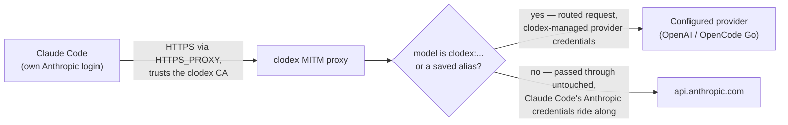
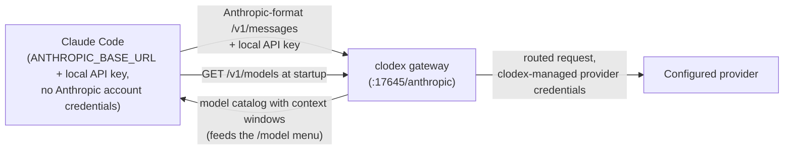

# clodex

[](https://www.npmjs.com/package/@bman654/clodex)

**clodex** lets you use your ChatGPT/Codex plan, OpenAI API models, or OpenCode Go models with Claude Code as first-class model choices.
You can use them anywhere you use Anthropic models like Opus and Sonnet — as the main session model, and in subagents, workflows, and agent teams. Clodex integrates them directly into Claude Code, using Claude Code's system prompt.
It works with your existing Claude Code plan as well as your Codex plans WITHOUT violating Anthropic's ToS.
No messing with CMUX or child codex processes or any of that stuff.
You can finally have Fable and Sol work together to solve the hardest problems.


You can also run clodex as a local OpenAI-compatible endpoint in front of your Codex plan, so any OpenAI-compatible client can use it.

> clodex is derived from the original [relay-ai](https://github.com/jacob-bd/relay-ai) project, heavily modified and streamlined for this one use case, with the full commit history preserved.

Contributions are welcome — see [CONTRIBUTING.md](./CONTRIBUTING.md) for how to scope a PR and what the quality bar is.

## Quick Start (ChatGPT/Codex plan)

```bash
npm install -g @bman654/clodex          # 1. install the CLI (Node 22+)
clodex providers auth openai   # 2. sign in with your ChatGPT/Codex plan (device-code OAuth)
clodex models                  # 3. pick favorite models and aliases
clodex models --alias sol=clodex:openai-oauth:gpt-5.6-sol
clodex models --alias luna=clodex:openai-oauth:gpt-5.6-luna
clodex models --alias terra=clodex:openai-oauth:gpt-5.6-terra
clodex patch                   # 4. (optional) patch Claude Code so those models are first-class
clodex claude                  # 5. launch Claude Code on an OpenAI model
```

1. **Install** — puts the `clodex` command on your PATH.
2. **Sign in** — opens a device-code OAuth flow for your ChatGPT/Codex plan; the token is stored in your OS credential store. If your workspace admin has disabled device code authorization, add `--browser` to sign in through your browser instead. (API-key users: `clodex providers add` instead.)
3. **Pick models** — an interactive manager for favorites (max 20) and short aliases like `sol` so you do not need to type the long names. Favorites drive the `/model` switch menu, proxy-mode routing, and the patcher.
4. **Patch** *(optional but recommended for proxy mode)* — bakes your favorites and aliases into the Claude Code binary so they pass model validation, appear in `/model`, and report their real context windows. Re-run after each `claude` update; `clodex patch --restore` undoes it. This step is required if you want to use clodex-routed models as subagents via the Agent tool.
5. **Launch** — starts Claude Code bridged to the model you choose.

## Supported providers

| Provider | Auth | Support |
|---|---|---|
| OpenAI | API key | Fully supported by the clodex maintainer |
| OpenAI (ChatGPT / Codex plan) | OAuth | Fully supported by the clodex maintainer |
| OpenCode Go | API key | Community-supported — maintained by its contributor |
| Custom OpenAI-compatible server (OpenRouter, vLLM, …) | API key, or none | Community-supported — maintained by its contributor |

**Community-supported** means the maintainer holds no account for that service,
so it cannot be exercised against the live API here or debugged when the vendor
changes something. Such an integration is reviewed and tested like everything
else and shipped gladly — it just depends on its contributor when upstream
moves. New providers land under this tier by default.

## Difference between Clodex and other solutions

| Feature | Clodex | relay-ai | CLIProxyAPI | Various process-based solutions |
|--------|--------|----------|-------------|----|
| url       | https://github.com/bman654/clodex |  https://github.com/jacob-bd/relay-ai | https://help.router-for.me/ |    |
| Works with Claude Code Plans without violating Anthropic TOS | ✅ | ✅ | ❌ | ✅ |
| Can use all claude models + All Codex models together? | ✅ | ✅ | ❌ | ✅ |
| Claude Code aware of true model context window size | ✅ | ❌ | ❌ | n/a |
| Supports Agent tool | ✅ | ❌ | ✅ | ❌ |
| Supports use in Dynamic Workflows | ✅ | ✅ | ✅ | ❌ |
| Routed models use Claude Code skills/tools | ✅ | ✅ | ✅ | ❌ |
| Routed models use Claude Code system prompt | ✅ | ✅ | ✅ | ❌ |
| Supports use in skill/agent frontmatter | ✅ | ❌ | ✅ | ❌ |
| Supports OpenAI prompt caching | ✅ | ❌ | ? | ✅ |
| Uses Websockets to talk to OpenAI API | ✅ | ❌ | ? | ✅ |

### Claude Code Plans and ToS

It's important to understand that any tool that duplicates Claude Code's OAuth login flow violates Anthropic's Terms of Service
and risks getting your account banned.  Any tool that initiates a Claude Code OAuth flow from outside of the Claude Code app falls
into this category.

Another way to tell: if a tool needs you to set `ANTHROPIC_BASE_URL` to a custom value, Claude Code can't run on your plan credentials — so the only way that tool can use your plan is by duplicating Claude Code's OAuth flow, which is against the ToS.

Clodex avoids this. In proxy mode it uses an HTTP proxy to intercept requests bound for `api.anthropic.com`: requests for an Anthropic model pass through unmodified, still carrying Claude Code's own auth token untouched — your plan credentials are never duplicated or replaced.

## Bridge modes

Both `clodex claude` and `clodex server` support two bridge modes. A mode flag applies to **that run only**; to change a command's default, add `--save-mode` (e.g. `clodex claude --endpoint --save-mode`). With no flag and nothing saved, both commands default to **proxy** mode, which works with your existing Claude auth.

- **`--proxy`** (the default): a selective man-in-the-middle proxy for `api.anthropic.com`. Claude Code keeps its normal Anthropic login — Anthropic models work untouched — while models named `clodex:<provider-id>:<model-id>` (or their saved aliases) route to the selected configured provider. Switch with `/model clodex:openai-oauth:gpt-5.6-sol` or `/model sol` after patching.
- **`--endpoint`**: clodex runs a local Anthropic-format gateway and launches Claude Code with `ANTHROPIC_BASE_URL` pointed at it. All traffic goes through the gateway. With favorites saved, the gateway is multi-route and Claude Code's `/model` menu lists your starting model plus favorites for live switching.

> [!TIP]
> Proxy mode allows you to continue using your Claude Code plan: login to claude code like normal and the proxy will intercept requests and leave requests for Anthropic models untouched, while requests for your favorite clodex models are routed to their configured providers.



In endpoint mode, no Anthropic account is involved — Claude Code is launched pointing at the local gateway with a local API key, and its startup `/v1/models` fetch powers the `/model` menu:



> [!TIP]
> Using Claude Code's agents view or background agents? Ask your Claude Code agent to read [docs/background-agents.md](docs/background-agents.md) and set it up for you — one global `clodex server --proxy` plus the `clodex-claude` wrapper bin bridges every claude process automatically.

> [!TIP]
> Using the Claude Code VS Code extension? `clodex-claude` launches your verified clodex-patched install in place of the extension's bundled binary, so clodex models appear in its model picker; follow the [VS Code setup](docs/background-agents.md#vs-code-model-picker). On Windows, `clodex install-vscode-launcher` first builds the `.exe` the extension needs to launch Claude Code through `clodex-claude`; see [docs/windows-setup.md](docs/windows-setup.md).

## CLI reference

### `clodex claude [options] [claude-flags]`

Launch Claude Code bridged to configured model providers. Unrecognized flags (and everything after `--`) pass through to Claude Code (`-c`, `--resume`, `--print`, …).

| Flag | Effect |
| --- | --- |
| `--endpoint` | Endpoint bridge mode for this run: local gateway + `ANTHROPIC_BASE_URL` |
| `--proxy` | Proxy bridge mode for this run: keep Claude Code's Anthropic auth; `clodex:` models route to configured providers (default when nothing is saved) |
| `--save-mode` | With `--endpoint`/`--proxy`: save that mode as the `claude` default |
| `--dry-run` | Run the wizard but print a launch preview instead of launching (never persists anything) |
| `--trace` | Write debug logs to `~/.clodex/logs/` and show errors on exit |
| `--fast` | Request Codex fast mode (`service_tier=priority`) for ChatGPT/Codex OAuth routes; equivalent to `CLODEX_SERVICE_TIER=fast` |
| `--provider <id>` | Boot provider id (`openai`, `openai-oauth`, or `opencode-go`); with `--model`, skips the wizard |
| `--model <id>` | Boot model id; with `--provider`, skips the wizard |
| `--context <model=stop>` | Use a different share of a model's context window for this launch only; never saved. Reaches Claude Code through the exported catalog, so a binary patched by `clodex patch` keeps its baked window until the stop is saved and the patch re-run |
| `--help`, `--version` | Help / version |

Notes:

- Claude Code may save the launched model to `~/.claude/settings.json`, so bare `claude` later can still show a clodex model name. Reset with `claude --model sonnet`.
- Non-interactive stdin reuses your last provider/model instead of showing the wizard.

### `clodex server [options]`

Foreground gateway, same two bridge modes, no Claude Code launch — point any Anthropic-format (or OpenAI-format) client at it.

Common options (both modes):

| Flag | Effect |
| --- | --- |
| `--endpoint` | Endpoint mode for this run: Anthropic-format HTTP gateway |
| `--proxy` | Proxy mode for this run: selective `api.anthropic.com` MITM proxy (default when nothing is saved; local only) |
| `--save-mode` | With `--endpoint`/`--proxy`: save that mode as the `server` default |
| `--port <1-65535>` | Listen port (default 17645) |
| `--no-discovery` | Don't advertise this server in `~/.clodex/server-runtime.json` (`CLODEX_NO_DISCOVERY=1` also works). Use it for a standalone endpoint the `clodex-claude` wrapper should ignore. |
| `--ws-diagnostics` | Log sanitized request envelopes and WebSocket head decisions, plus the usage-limit reports the OpenAI socket sends, verbatim (they include account state such as credits) |
| `--help`, `--version` | Help / version |

Endpoint mode only (an error if combined with `--proxy`):

| Flag | Effect |
| --- | --- |
| `--quick`, `--saved` | Start immediately from saved/default settings, skipping the wizard |
| `--listen local\|network` | One-run listen mode override |
| `--providers all\|favorites\|id1,id2` | One-run provider catalog override |
| `--mask-gateway-ids` / `--no-mask-gateway-ids` | Mask or expose vendor names in discovery model ids (see below) |
| `--password <value>` | One-run network-mode server password |

Proxy mode has no extra options — it takes only the common options.

Bare `clodex server` uses the saved default mode (proxy if none saved). Proxy mode starts immediately. Endpoint mode on a TTY opens a short wizard — start from saved settings, or configure: favorites-only catalog?, which providers to expose, discovery-id masking, and listen local/network (network asks for a password). Without a TTY (or with `--quick`/any endpoint-mode option) it skips all prompts and starts from saved settings; network mode then needs a saved password or `--password`.

**`--mask-gateway-ids`:** endpoint-mode discovery ids look like `anthropic-openai-oauth__gpt-5.6`. Some Claude clients validate model names (Claude Desktop / Cowork pickers, Claude Code skill/agent `model:` frontmatter) and reject or filter ids containing non-Anthropic vendor names. Masking reverses the provider and model segments (`anthropic-htuao-ianepo__6.5-tpg`) so vendor strings never appear literally; display names stay readable (`GPT 5.6 (OpenAI)`). As the request `model`, the gateway accepts the masked id, the unmasked id, the canonical `clodex:<provider>:<model>` id, or a saved alias (e.g. `luna`) — and the response echoes back whichever id you sent. Tradeoff: masked ids are unreadable — copy them exactly from the printed catalog. Masking is on by default; use `--no-mask-gateway-ids` for clients that don't need it.

Endpoint-mode endpoints (default port 17645):

```
ANTHROPIC_BASE_URL=http://127.0.0.1:17645/anthropic
OPENAI_BASE_URL=http://127.0.0.1:17645/openai/v1
```

Use any API key locally; network mode requires the server password. Proxy mode prints `HTTPS_PROXY`, `HTTP_PROXY`, `NODE_EXTRA_CA_CERTS`, and adjusted `NO_PROXY` / `no_proxy` values to export. The adjusted bypass lists preserve unrelated hosts while ensuring `api.anthropic.com` reaches the selective proxy. Do **not** set `ANTHROPIC_BASE_URL` in that mode.

Several `clodex server` instances can run at once — each advertises itself in `~/.clodex/server-runtime.json`, and `clodex-claude` prefers a proxy-mode server (newest first) when bridging (see [docs/background-agents.md](docs/background-agents.md)). Pass `--no-discovery` to keep a server out of that file, e.g. a dedicated endpoint you point another tool at.

Examples:

```bash
# Endpoint gateway serving only your favorites, no prompts, for a local client
clodex server --endpoint --quick --providers favorites

# Proxy mode for an existing-auth Claude Code (export the env it prints)
clodex server --proxy
```

### `clodex patch`

Patch the installed Claude Code binary so clodex favorites and aliases are first-class: accepted by the Agent tool's model field, listed in `/model`, resolved to their real ids, and reporting the correct context window.

| Flag | Effect |
| --- | --- |
| `--restore` | Restore the pristine (unpatched) Claude Code binary |
| `--trace` | Show per-site `OK`/`SKIP`/`FAIL` results |
| `--enable-local-patches` | Persistently enable the fixed local patch module |
| `--disable-local-patches` | Disable local patches and rebuild from pristine bytes without them |
| `--help` | Help |

On Windows, when Claude Code was installed with `npm install -g`, the `claude` on your PATH is a small launcher script (`claude.cmd`, `claude.ps1`, and an extensionless one) rather than the program itself; `clodex patch` follows it to the program and patches that. (On macOS and Linux npm makes a symlink instead, which always worked.) If the launcher cannot be followed — its program moved or removed, or it names two different programs — `clodex patch` stops without touching anything and tells you to set `TWEAKCC_CC_INSTALLATION_PATH` to the program directly.

`clodex patch` also stops the hook banner flashing. Every hook Claude Code runs — even one that finishes in 20 ms — makes the spinner line read `running PreToolUse hook` for a frame or two. A patched binary hides that line until a hook has actually been running for half a second, so a quick hook never paints it and a hook that genuinely blocks for a second still shows it. Nothing to configure.

The patch map is built from your favorites and aliases; context windows come from provider metadata. A pristine per-version backup is kept — recorded against the install it was made for, so a machine with two installs of one Claude Code version restores each from its own bytes — and a manifest (`~/.clodex/patch-state.json`) makes re-runs no-ops until your config or Claude Code version changes — then the binary is restored first and re-patched fresh. `clodex claude` checks patch freshness at launch and offers to re-patch (a non-blocking notice when not interactive). Re-run `clodex patch` after every `claude` update.

#### Local patches (trusted code)

Local patches are an explicitly enabled extension layer for private transforms that do not belong in clodex itself. Put one self-contained ES module at `~/.clodex/local-patches.mjs` (or `$CLODEX_HOME/local-patches.mjs`) and opt in with `clodex patch --enable-local-patches`. It must be a regular UTF-8 file no larger than 1 MiB. File presence alone never loads it.

Enabling this feature executes that JavaScript with your full user permissions; it is not sandboxed. Only use code you trust. Clodex never searches the current project, its installation, dependencies, or `node_modules` for patches.

The module must default-export an array. Each site has a unique lowercase `id` and an `apply` function that returns the complete source and emits the generated `marker` exactly once when it applies:

The `source` your `apply` receives is every JavaScript module in the binary joined together, with a ``/*clodex:module-boundary`;{}"]*/`` line between them. This is true of every Claude Code version — a pre-2.1.242 binary carries the bundle plus five small helper modules; a 2.1.242-or-later one carries the bundle split across roughly 1,370. Match and replace as you always have; just do not add or remove one of those lines, or the whole patch is refused. (The punctuation in the marker is there so that a wildcard bounded by a character class cannot run across a module boundary.)

If your transform works by **position** rather than by matching an anchor, mind where it lands: text prepended to `source` goes into the first module and text appended to it goes into the last, and neither is necessarily the module that runs at startup. Anchor your edit to text you match, the way the examples below do.

```js
export default [
  {
    id: 'example-site',
    apply(source, { marker }) {
      const anchor = 'exampleAnchor()';
      if (!source.includes(anchor)) return source;
      return source.replace(anchor, `${marker}${anchor}`);
    },
  },
];
```

Clodex hashes the captured module bytes into patch freshness, so editing the file triggers a pristine rebuild. The module is then applied after all built-in routing sites as one transaction: if any local site fails, every local change is discarded, the complete built-in patch still publishes, and `--trace` reports the failure. Local sites receive markers in the separate `/*clodex-local:...*/` namespace and cannot add, remove, or replace built-in `/*ccpatch:...*/` markers. Before publishing local output, Clodex compares exact postconditions captured from every successful built-in site and reruns the built-in verifier. Keep the module deterministic and self-contained; imported helper files are not part of its freshness identity.

### `clodex models` / `clodex favorites`

Manage favorite models (max 20) and short aliases. Favorites feed the endpoint-mode `/model` switch menu, proxy-mode routing, and the patcher. Saved to `~/.clodex/config.json`.

| Flag | Effect |
| --- | --- |
| *(none)* | Interactive manager: search all providers or browse one at a time |
| `--list` | Print the exact `clodex:<provider-id>:<model-id>` names (and aliases) without opening the manager |
| `--alias <name=target>` | Save a short name for a favorite, e.g. `--alias sol=clodex:openai-oauth:gpt-5.6-sol` (the `clodex:` prefix is optional in the target) |
| `--unalias <name>` | Remove a saved short name |
| `--context <model=stop>` | Choose how much of a model's context window to use: `standard`, `max`, `default` to clear, or a token count such as `500k`. Applies to this run unless `--save` is given |
| `--save` | With `--context`: store the stop as that model's default |
| `--json` | Print resolved metadata for saved favorites as JSON (ids, aliases, context stop and windows, output limit, pricing boundary, effort levels). Diagnostics go to stderr so stdout stays parseable |
| `--help`, `--version` | Help / version |

#### Context stops and the pricing boundary

A context window is a cost dial as much as a capacity number. OpenAI prices GPT-5.5
and later prompts above **272,000 input tokens at 2x input and 1.5x output for the
full request**, which is why the Codex catalog reports a 272,000 window rather than
the model's ceiling. Newer families inherit the same boundary, so a model released
after this was written is covered without a clodex update. Clodex follows that: the
default `standard` stop stays under the line, and a larger window is something you
ask for.

```sh
clodex models --context sol=max --save     # this model's default, with a cost warning
clodex claude --context sol=max            # this launch only, nothing saved
clodex models --context sol=default --save # back to the provider's tuned window
```

Each stop is reported with the numbers behind it: the raw window, the effective
window a client should fill, and the account ceiling a larger stop can reach. A stop
above the ceiling is clamped and says so. When a request's own reported token count
crosses the boundary, clodex warns once per model for the life of the process,
because the client's token count and the provider's differ after translation and only
the provider's settles it.

Two things worth knowing about the numbers:

- **Clodex reports the window the provider actually gives, and holds nothing back.**
  Deciding how much of a window to leave free is the client's job — Claude Code
  already reserves a fixed amount below whatever window it is told, and shrinking the
  number first only costs usable context. A provider that declares a share of its own
  is still honoured; clodex just never invents one. Use `--context` if you want a
  smaller window than the provider offers.
- **A window nobody published is not a ceiling.** Some servers list their models
  without saying how much context each one takes. Clodex reports the 200,000 Claude
  Code assumes anyway, but that number is a guess, not a measurement — so
  `clodex models --context <model>=1m --save` raises it instead of being clamped back
  down to the guess. Clamping still applies in full wherever a window *is* published,
  by the provider or by clodex's own catalog. If the model is already baked into a
  patched binary, re-run `clodex patch` so it picks the new window up. Set this model up
  before this version? Run `clodex providers refresh-models <provider>` once — an older
  clodex stored the guess as if the server had published it, and until you refresh it is
  indistinguishable from a real limit and still clamps.
- **The account ceiling moves.** It is server-side and per-account, and it has
  changed by more than 2x within a single day in the past. `max` reads whatever the
  catalog reports now and clamps to it, so a stale ceiling shrinks the stop rather
  than overshooting it.

### `clodex providers [subcommand]`

| Subcommand | Effect |
| --- | --- |
| *(none)* | Provider hub wizard |
| `add` | Add OpenAI or OpenCode Go with an API key, add a custom OpenAI-compatible server by base URL, or sign in with ChatGPT |
| `auth openai` | Sign in with ChatGPT/Codex-plan OAuth (device code; `--browser` for workspaces that disable device codes) |
| `list` | Show configured providers |
| `remove <id>` | Remove a provider by id |
| `refresh-models [id]` | Update cached model lists |

Providers supported: `openai` (API key, platform.openai.com), `openai-oauth` (ChatGPT/Codex plan), and `opencode-go` (OpenCode Go API key). OpenCode Go exposes its Anthropic Messages, Chat Completions, and Responses models; entries whose transport has not been verified against the live endpoint are left out. See [OpenCode Go provider](docs/opencode-go.md).

A **custom OpenAI-compatible server** is any OpenAI-style API, given by its base URL (the part before `/chat/completions`), such as `https://openrouter.ai/api/v1`. `providers add` asks for a name, the base URL and an API key (leave it empty for a local server without auth), lists the server's models to check the connection, and saves the provider as `custom-<name>`. Its models then appear in `clodex models`; once saved as favorites they are addressed as `clodex:custom-<name>:<model>` and can be given a short alias with `clodex models --alias`. The base URL is checked before anything is saved: plain `http://` is accepted only after you confirm it, and only for loopback or private-network addresses, and an `https://` URL whose host is, or resolves to, a loopback (`127.0.0.0/8`, `::1`), private, link-local, unique-local, carrier-grade-NAT or well-known cloud-metadata address is refused. A model's id and name are stored with surrounding whitespace trimmed, and a model whose trimmed id or name still contains a control character is skipped, whether the list is fetched by `providers add` or by `providers refresh-models`, and error text from the server is shown with control characters replaced by spaces. Only the OpenAI-compatible kind is offered in the menu.

### `clodex install-vscode-launcher`

Windows only. Builds `%USERPROFILE%\.clodex\bin\clodex-claude.exe`, the executable the Claude Code VS Code extension can use as its `claudeCode.claudeProcessWrapper`, so chats in the editor launch Claude Code through `clodex-claude` (on Windows npm installs that wrapper as three script shims — extensionless, `.cmd`, `.ps1` — and no executable the extension can spawn). It compiles a short C# source shipped in the package with the compiler already inside the .NET Framework — nothing is downloaded — and prints the setting to paste; it never edits VS Code or Claude settings. The paths to `node.exe` and the clodex install are compiled in, so re-run it after switching Node versions or moving clodex. Setup guide: [docs/windows-setup.md](docs/windows-setup.md).

### Root

```
clodex --help       # overview of all commands
clodex --version    # version
```

## Configuration

- Config home: `~/.clodex` (override with `CLODEX_HOME`). A legacy `~/.relay-ai` directory is never read or modified — automatic migration from it was removed in 2.0.0.
- The config-home filesystem and the native account home must support hard
  links because registry and credential locks are published atomically. Keep
  `CLODEX_HOME` and `~/.clodex/credential-locks` on local filesystems rather
  than FAT, exFAT, or a network mount that rejects hard links. An abrupt process
  kill during lock publication can leave a `*.lock.*.tmp` file; it does not
  block later lock acquisition and can be removed when no Clodex process is
  running. A canonical `providers.json.lock` whose recorded PID is no longer
  running is reclaimed automatically on the next lock acquisition. If it
  remains while that PID is active, stop every Clodex process and verify the
  recorded PID before removing the lock manually. Never remove the canonical
  lock while a Clodex process is active.
- Credentials live in the OS credential store (Keychain / Windows Credential
  Manager / Secret Service). The `clodex` service holds the main value or
  published marker; `clodex-chunks` holds current long-credential chunks;
  `clodex-journal` holds crash-recovery metadata and a deletion marker; and
  `clodex-deleted` holds a redundant non-secret deletion guard. A
  `clodex-state-key` entry protects each account's recovery metadata. Use
  Clodex provider removal instead of deleting these entries individually.
  Authenticated encrypted per-account managed-state markers live under the
  native OS account home at `~/.clodex/keyring-state`; before each journal
  write they record the exact recovery intent so a retry can replay and verify
  it. The encryption key remains in the OS credential store, so the filesystem
  marker alone cannot be used to test credential guesses. The marker also
  prevents a temporarily unavailable keyring journal from being mistaken for
  an absent one. If the OS credential store was completely reset, Clodex
  permits direct reauthorization only after sentinel checks prove the main and
  chunk namespaces are empty. Hidden, locked, or partially restored state
  remains fail-closed. Credential mutation locks live beside that state at
  `~/.clodex/credential-locks`. Both paths are independent of `CLODEX_HOME` and
  runtime or temporary-directory environment overrides. This keeps concurrent
  processes serialized when they use different config homes. Set
  `CLODEX_CREDENTIAL_HELPER` to an absolute executable path to use an external
  secure store instead; see [credential helpers](docs/credential-helpers.md).
- Proxied routes forward configured provider headers for API-key and OAuth authentication. Anonymous routes preserve non-credential headers while removing authorization, API-key, cookie, token, secret, and credential-bearing header names before dispatch.
- `CLODEX_CLAUDE_PATH` overrides which Claude Code gets **launched**. It does not choose what
  `clodex patch` writes to — set `TWEAKCC_CC_INSTALLATION_PATH` for that, and `clodex patch`
  says so when `CLODEX_CLAUDE_PATH` points somewhere else. The two are separate because a
  `CLODEX_CLAUDE_PATH` aimed at a wrapper script is right for launching and wrong for patching.
- **Codex service tier:** `CLODEX_SERVICE_TIER` accepts `fast` (normalized to
  `priority`), `priority`, `flex`, `auto`, or `default`. Clodex requests the
  resolved value only after selecting a ChatGPT/Codex OAuth route; OpenAI
  API-key and non-OpenAI routes are unaffected. `clodex claude --fast` sets the
  value to `fast` for that invocation, overriding an ambient value, and composes
  the same environment before a dry-run preview. Request diagnostics record
  this pre-dispatch intent, not proof of wire serialization. If the provider
  SDK reports that it omitted the tier for a model, clodex warns once and the
  backend default remains in use.
- **Outbound proxy:** when `HTTP_PROXY`/`HTTPS_PROXY` (and optionally `NO_PROXY`) are set in clodex's environment, all clodex-originated network calls honor them — OAuth sign-in and token refresh, model-list and models.dev refreshes, upstream OpenAI API calls, and the ChatGPT/Codex OAuth WebSocket transport (tunneled via HTTP CONNECT).
- **Provider timeouts:** `CLODEX_UPSTREAM_IDLE_TIMEOUT_MS` controls how long an
  SDK-backed translated stream may produce no event (default `120000`; range
  `10000`–`3600000` ms). `CLODEX_UPSTREAM_TOTAL_TIMEOUT_MS` limits each call
  clodex makes to a configured provider, including non-streaming calls (default
  `600000`; range `60000`–`21600000` ms). An authentication refresh can start a
  new call with a fresh timer, so this is not an end-to-end route deadline. Set
  both variables on the process serving the request: the embedded server
  started by `clodex claude`, or a standalone `clodex server`. `clodex-claude`
  only connects to an existing server, so setting them on that wrapper does not
  reconfigure the server. Empty values use the defaults, malformed values are
  ignored, and integers outside the supported ranges clamp to the nearest
  bound. Clodex warns once for each malformed, clamped, or inconsistent setting
  when a request first resolves it; `clodex claude` displays that parent notice
  after Claude Code exits. The total timeout can never be shorter than the idle
  timeout: increasing only the idle timeout raises the default total to match,
  while an explicit shorter total lowers the idle timeout. The 10s/1m floors
  avoid near-immediate termination; the 1h/6h ceilings allow deliberately long
  calls without leaving stalls attached indefinitely. At either deadline,
  clodex aborts the SDK call; cancellation is cooperative, so a provider
  transport that ignores the abort signal can settle later. clodex also asks
  the provider to stop as soon as the client that made the request goes away —
  a Ctrl-C, a killed agent, or a closed browser — instead of waiting for a
  deadline, whether the answer had started arriving or not. The same
  cooperative limit applies: clodex stops relaying and requests cancellation,
  but cannot guarantee the provider stops generating. These are
  server-side limits, and callers may stop sooner. Claude Code currently
  defaults to about 180s of downstream byte silence in proxy mode and 300s in
  endpoint mode, with
  a 30m byte-watchdog ceiling. In Claude Code's environment, `API_TIMEOUT_MS`
  controls the pre-header deadline; `CLAUDE_STREAM_IDLE_TIMEOUT_MS` and
  `CLAUDE_BYTE_STREAM_IDLE_TIMEOUT_MS` control stream silence. Waits beyond 30m
  also require `CLAUDE_ENABLE_BYTE_WATCHDOG=false`. With a standalone server,
  set those client variables on the Claude Code process, not the server.
- **Upstream retries:** clodex retries retryable failures on SDK-backed
  provider calls up to `5` times by default. Set
  `CLODEX_UPSTREAM_MAX_RETRIES` to a non-negative integer to override it; `0`
  disables retries. The default and configuration ceiling
  are derived from the resolved idle timeout and the SDK's fallback 2s, 4s, 8s,
  … backoff, so a shorter idle timeout automatically lowers both. The ceiling
  is `5` at the default timeout and can rise to `10` at the maximum. Larger
  integers clamp with a one-time warning that names the active idle timeout.
  Without a retry hint, five retries can add roughly 62s of fallback
  backoff instead of the SDK default's roughly 6s, giving a transiently
  unavailable provider more time to recover. When OpenAI explicitly states an
  acceptable delay for a WebSocket throttle, clodex gives that value to the
  SDK instead of its fallback schedule. Clodex's existing 5s default remains a
  client-facing hint for upgrade 403s and WebSocket connection-limit errors
  that state no delay; it does not replace the SDK's fallback. Other hintless
  429s also retain the fallback schedule. Provider `retry-after` hints and time
  spent in failed attempts can mean fewer retries start before a streaming idle
  deadline; the shared abort signal still
  interrupts backoff when that deadline fires. If a deadline interrupts a
  retry delay, clodex preserves the provider failure that prompted the retry;
  if a currently active call is silent, clodex reports the timeout instead.
  Unset, empty, or malformed values preserve the clodex default. The SDK only
  retries before model output is exposed downstream; a stream that fails after
  partial output cannot be
  replayed safely and still terminates the request. The same
  retry setting also controls proxy mode's raw HTTP MITM path, which replays
  once by default and retains an independent ceiling of `5`. Only a request
  sent on a pooled connection the far end had already closed, with no response
  received, is replayed there; other direct raw relays add no transport-failure
  replay (an OAuth 401 refresh can still start a new authenticated call). The
  timeout settings add no timers to any raw relay. A valid
  `CLODEX_UPSTREAM_MAX_RETRIES` value takes precedence on the HTTP MITM path;
  otherwise, Claude Code's own `CLAUDE_CODE_MAX_RETRIES=0` disables that replay
  so telling the client never to resend a request is not quietly undone one
  layer down.
  Recovered requests appear in the inference log as `response_retried`.
- **Connection pacing (ChatGPT/Codex plans):** when many agents run at once,
  clodex spaces out the new connections it opens to OpenAI, which should make a
  burst of parallel work less likely to trip OpenAI's own rate limit. (In the
  traffic we sampled, the rejections clustered in the busiest minutes; that the
  rate is what triggers them is a reasonable reading of that, not something we
  can prove.) A follow-up turn that already has a connection it can reuse when
  it arrives is never delayed by this;
  what goes through the limiter is work that needs a *new* connection — a first
  turn, a conversation that branched, or several agents running at once. If a
  turn that is waiting its place in the queue finds, on being let through, that
  a connection has freed up and is carrying exactly the conversation it is
  continuing, it picks that one up instead of opening another. That is
  uncommon — it needs another turn to finish inside the few seconds this one
  spends waiting AND to have been on the same conversation history — so treat
  it as an edge taken when it appears, not as agents routinely sharing
  connections. The
  default is 60 new connections a minute, with an allowance of 10 opened back
  to back after a quiet spell.
  **This is a real throughput ceiling, not a brief pause.** One new connection
  per second means that if you run many agents at once and each needs its own
  connection, they end up sharing that budget: roughly 20 agents settle at
  about 20 seconds per turn instead of a few seconds. That is the trade — you
  wait longer, in exchange for a lower chance of losing turns to rate-limit
  errors. It reduces that risk rather than removing it: clodex cannot see
  OpenAI's actual limit, and under a heavy enough fan-out pacing can itself
  answer a turn with a rate-limit response. Work over the
  rate is queued for a few seconds, and anything still over is answered with
  the same "try again shortly" response OpenAI itself would return, which
  clodex retries for you with backoff. Set
  `CLODEX_WS_MAX_NEW_CONNECTIONS_PER_MIN` to another whole number between `1`
  and `600` to change the rate, or to `0` to turn pacing off. Higher values
  clamp to `600` with a one-time warning, and an unreadable value is reported
  once and ignored. If you have turned retries off with
  `CLODEX_UPSTREAM_MAX_RETRIES=0`, pacing never refuses a request — but it also
  stops limiting once its initial allowance is used up, because there would be
  nothing left to retry a refused request. The same applies at very low rates:
  if clodex cannot retry a turned-away request for long enough to reach the
  next free connection slot — which is the case around 1 or 2 connections a
  minute at the default timeouts — it admits the excess late rather than
  failing it, and says so once. Turning a rate that low into hard failures
  would manufacture the errors this feature exists to reduce.

## Known limitations

- Cost display inside Claude Code is inaccurate for routed third-party models (Claude Code applies its own pricing table).
- In the endpoint-mode switch menu, the displayed context window reflects the launch model and does not update on live `/model` switches (Claude Code fetches window metadata once at startup). Proxy mode with `clodex patch` reports correct per-model windows.
- ChatGPT/Codex OAuth requires `store:false` upstream; some OpenAI cache controls are intentionally omitted on OAuth routes because they returned empty responses during compatibility testing.

## License

MIT — see [LICENSE](LICENSE).
